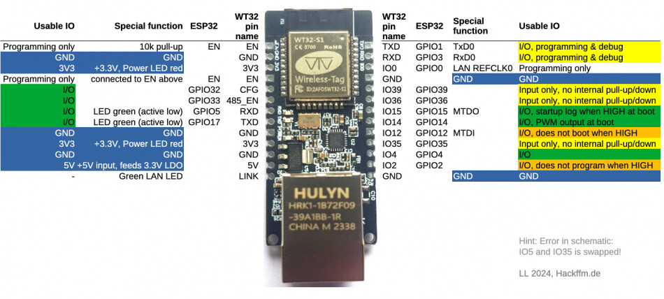
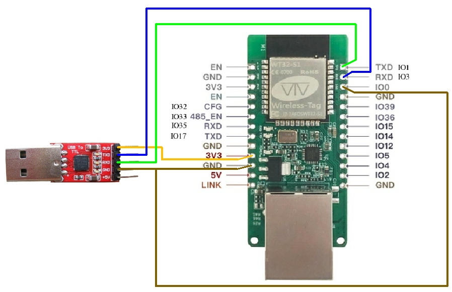

## ESP32-ETH01

### FT232RL -> ESP32-ETH01 Connections

| **FT232RL Pin** | **ESP32-ETH01 Pin** | **Description**     |
| -------------------- | ----------------------- | ------------------------- |
| VCC (5v)             | 5V                      | Power Supply              |
| RX                   | TX0                     |                           |
| TX                   | RX0                     |                           |
| GND                  | GND                     | Ground                    |
| GND                  | IO0                     | **On boot** to upload code|

#### Lib
- [https://github.com/Networking-for-Arduino/EthernetESP32](https://github.com/Networking-for-Arduino/EthernetESP32)