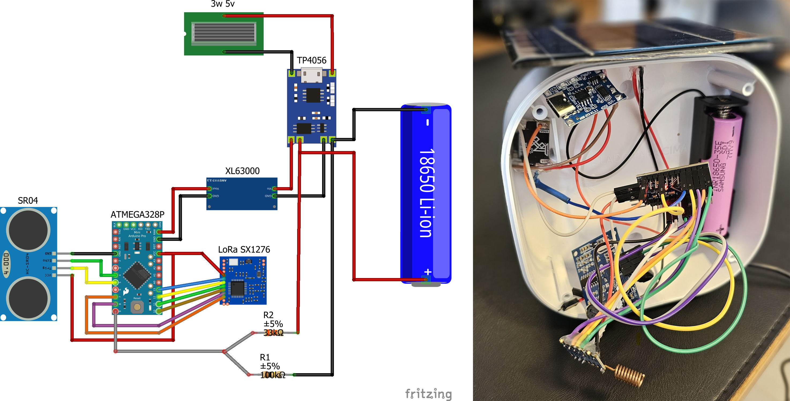

# [ATMEGA328] LoRa Water tank level meter

This project measures the water tank level using the **JSN-SR04T** ultrasonic sensor, with data processing handled by an **ATMEGA328** and transmission via LoRa using the **SX1278** module.

The system is powered by a **18650 battery with solar charging**, and the battery voltage and charge percentage are also monitored. Ensuring battery operation was crucial, as the location is approximately **120 meters from the receiver** and has no power supply. In my tests, the system ran for **15+ days on battery** power alone (without recharging).

On the receiving end, a **LoRa32** receives the transmitted data and forwards it to an MQTT server, enabling integration with monitoring or automation systems.

## List of Components

Here is the list of components used in this project, including links for purchasing:

- [JSN-SR04T Ultrasonic Sensor](https://pt.aliexpress.com/item/1005006320348756.html)
- [ATMEGA328 3.3V 8MHz Microcontroller](https://pt.aliexpress.com/item/1005005096327373.html)
- [XL63000 Voltage Regulator](https://pt.aliexpress.com/item/1005006240120884.html)
- [SX1278 LoRa Module](https://pt.aliexpress.com/item/1005005096327373.html)
- [18650 Battery Holder Case](https://pt.aliexpress.com/item/1005006283741317.html)
- [18650 Lithium Battery](https://pt.aliexpress.com/item/1005006227891015.html)
- [TP4056 Battery Charger Module](https://pt.aliexpress.com/item/1005006585278260.html)
- [3W, 5V Solar Panel](https://pt.aliexpress.com/item/1005006259573646.html)
- [33kΩ and 100kΩ Resistors (Pack)](https://pt.aliexpress.com/item/1005002344985336.html)
- [Jumper Wires (Pack)](https://pt.aliexpress.com/item/1005005945668553.html)
- [LILYGO® Ttgo LoRa32 Development Board](https://pt.aliexpress.com/item/32872078587.html)

*This list includes all the components and modules required to build the project. Be sure to double-check the specifications of each item before purchasing.*

## Transmitter Wiring Diagram



## Pin Connections

#### SX1278 LoRa Module to ATMEGA328 Connections

The table below shows the pin connections between the SX1278 LoRa module and the ATMEGA328 microcontroller.

| **SX1278 Pin** | **ATMEGA328 Pin** | **Description**     |
| -------------------- | ----------------------- | ------------------------- |
| VCC                  | 3.3V                    | Power Supply              |
| GND                  | GND                     | Ground                    |
| SCK                  | Pin 13 (SCK)            | Serial Clock (SPI)        |
| MISO                 | Pin 12 (MISO)           | Master In Slave Out (SPI) |
| MOSI                 | Pin 11 (MOSI)           | Master Out Slave In (SPI) |
| NSS                  | Pin 10 (CS)             | Chip Select (SPI)         |
| DIO0                 | Pin 2 (INT0)            | Interrupt Pin (optional)  |

#### JSN-SR04T Ultrasonic Sensor to ATMEGA328 Connections

The table below shows the pin connections between the JSN-SR04T ultrasonic sensor and the ATMEGA328 microcontroller.

| **JSN-SR04T Pin** | **ATMEGA328 Pin** | **Description**        |
| ----------------------- | ----------------------- | ---------------------------- |
| VCC                     | 3.3V                    | Power Supply                 |
| GND                     | GND                     | Ground                       |
| TRIG                    | Pin 4 (Digital I/O)     | Trigger Pin                  |
| ECHO                    | Pin 5 (Digital I/O)     | Echo Pin (Input from sensor) |

#### Additional Connections

The remaining connections for the battery, solar panel, and other components are straightforward and follow the schematic shown above. Please refer to the schematic diagram for detailed wiring.

## ATMEGA328 Code

Below is the code used on the ATMEGA328 for this project. It handles the water level measurement using the JSN-SR04T sensor and sends the data via LoRa using the SX1278 module.

The provided code is a baseline and should be adjusted according to your project's specifics and requirements. Key areas to review and customize include:

- **Timing Parameters**: The deep sleep interval is approximately **1 minute and 30 seconds**, optimized for energy efficiency. Adjust this duration in the loop if your project needs more frequent or less frequent measurements.
- **Voltage and Calibration Factors**: Battery voltage range and correction factors are tailored for the 3.3V ATMEGA328 used in this project. Ensure these values align with your specific microcontroller and power setup.
- **Sensor and Module Pins**: Pins defined for the JSN-SR04T and SX1278 modules may differ depending on your circuit design. Adjust the pin configurations accordingly.

#### Libs

- [LoRa.h](https://github.com/sandeepmistry/arduino-LoRa)
- [LowPower.h](https://github.com/LowPowerLab/LowPower)

#### Code

```cpp
#include <LoRa.h>
#include "LowPower.h"

// SR04
#define triggerPin 4
#define echoPin 5
#define measureInterval 30  // MAX 35 ms for up to 6.0m, MIN 5 ms for up to 0.8m
#define measureCount 5      // Number of measurements to take
float distance;
float simpleReading();
float calculateDistance();
float batteryReading();

// LoRa
#define ss 10   // NSS connected to D10
#define rst 9   // RST connected to D9
#define dio0 2  // DIO0 connected to D2

// Battery
#define BATTERY_MAX 4.075  // Maximum battery voltage
#define BATTERY_MIN 3.2    // Minimum battery voltage
const int batteryPin = 24; // A1
const float multiplicationFactor = 1.33;  // R1 (33k) + R2 (100k) / R2 (100k)
const float arduinoVoltage = 3.3;         // Reference voltage of the ATMEGA328
const float correctionFactor = 0.9255;   // Corrects reading based on the multimeter

void setup() {
  // SR04
  pinMode(triggerPin, OUTPUT);
  pinMode(echoPin, INPUT);

  // LoRa
  LoRa.setPins(ss, rst, dio0);
  if (!LoRa.begin(915E6)) { // 915MHz
    delay(100);
    while (true)
      ;
  }
}

void loop() {
  // Deep Sleep
  for (int i = 0; i < 10; i++) {  // 11 x 8s = 88s (~1 minute and a half)
    LowPower.powerDown(SLEEP_8S, ADC_OFF, BOD_OFF);
  }
  delay(100);

  // SR04
  distance = calculateDistance();

  delay(100);

  // Battery
  int batteryValue = batteryReading(); // Valid battery reading
  float inputReading = (batteryValue / 1023.0) * arduinoVoltage * correctionFactor;
  float batteryVoltage = inputReading * multiplicationFactor;
  float batteryPercentage = calculateBatteryPercentage(batteryVoltage);

  delay(100);

  // LoRa
  LoRa.beginPacket();
  String msg = "{\"id\":\"watertank\",\"v\":" + String(batteryVoltage) + ",\"p\":" + String(batteryPercentage) + ",\"d\":" + String(distance) + "}";
  LoRa.print(msg);
  LoRa.endPacket();
}

float batteryReading() {
  float batterySum = 0;
  float batteryResult = 0;
  for (int index = 0; index < measureCount; index++) {
    delay(5);
    batterySum += analogRead(batteryPin);
  }
  batteryResult = (float)batterySum / measureCount;
  return batteryResult;
}

float calculateDistance() {
  float distanceSum = 0;
  float distanceResult = 0;
  for (int index = 0; index < measureCount; index++) {
    delay(measureInterval);
    distanceSum += simpleReading();
  }
  distanceResult = (float)distanceSum / measureCount;
  return distanceResult;
}

float simpleReading() {
  long duration = 0;
  float distanceResult = 0;
  digitalWrite(triggerPin, LOW);
  delayMicroseconds(2);
  digitalWrite(triggerPin, HIGH);
  delayMicroseconds(10);
  digitalWrite(triggerPin, LOW);
  duration = pulseIn(echoPin, HIGH);
  distanceResult = duration * 0.03532;
  return distanceResult;
}

float calculateBatteryPercentage(float currentVoltage) {
  if (currentVoltage >= BATTERY_MAX) {
    return 100.0;
  } else if (currentVoltage <= BATTERY_MIN) {
    return 0.0;
  } else {
    return ((currentVoltage - BATTERY_MIN) / (BATTERY_MAX - BATTERY_MIN)) * 100.0;
  }
}
```

<br>

## LoRa32 Receiver - TTGO LoRa32 V2.1

The **TTGO LoRa32 V2.1** receiver is used with the **OpenMQTTGateway** library as a LoRa gateway. This setup allows the receiver to receive LoRa messages and forward them via MQTT.

For configuration, simply follow the [OpenMQTTGateway documentation](https://docs.openmqttgateway.com/upload/web-install.html) to set up the receiver and connect it to your MQTT platform.

This solution enables seamless communication between LoRa devices using the 915 MHz frequency.

## References

- [Powering ESP32/ESP8266 with Solar Panels and Battery Level Monitoring](https://randomnerdtutorials.com/power-esp32-esp8266-solar-panels-battery-level-monitoring/)
- [Distance Measurement Project by abtom87](https://github.com/abtom87/Distance-measurement-)
- [Deep Sleep Example for ATMEGA328P](https://github.com/RalphBacon/Arduino-Deep-Sleep/blob/master/Sleep_ATMEGA328P.ino)
- [LoRa Communication with Arduino P2P](https://www.makerhero.com/blog/comunicacao-lora-com-arduino-p2p/)
- [OTAA-Based LoRaWAN Node with Arduino SX1276](https://how2electronics.com/otaa-based-lorawan-node-with-arduino-lora-sx1276/)
- [Mailbox Guard Project](https://github.com/PricelessToolkit/MailBoxGuard)
- [Onedrive Link](https://onedrive.live.com/?authkey=%21AIzzyuwUAotKD8A&id=CD05BF6E6E1D1C15%214646&cid=CD05BF6E6E1D1C15)
- [LoRa with ESP8266 Blog Post](https://fazerlab.wordpress.com/2020/09/08/lora-com-esp8266/)
- [OpenMQTTGateway Example: Lora Temperature](https://github.com/1technophile/OpenMQTTGateway/blob/development/examples/LoraTemperature/src/main.cpp)
- [Arduino Pro Mini Wiki](https://land-boards.com/blwiki/index.php?title=Arduino_Pro_Mini)
- [Thingiverse: LoRa Antenna Project](https://www.thingiverse.com/thing:6768553)

## Acknowledgments

Thank you for checking out this project! I hope it helps you with your own IoT applications.

A special thank you to the authors and contributors of the resources in the references section.

Contributions, suggestions, and improvements are always welcome. Feel free to fork the repository and open a pull request with your changes.
